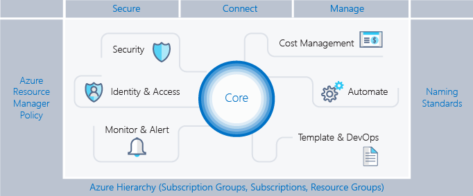
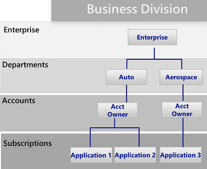
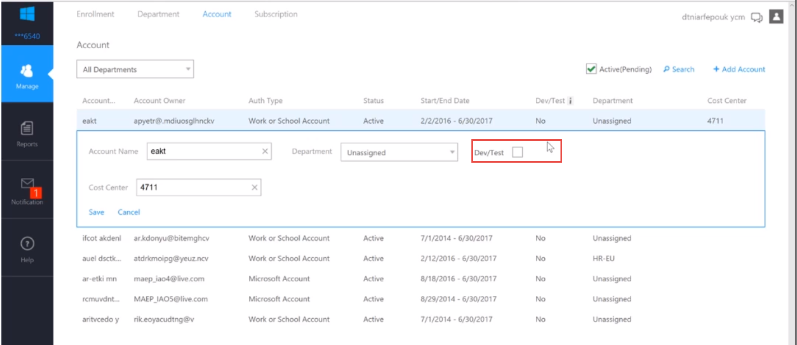
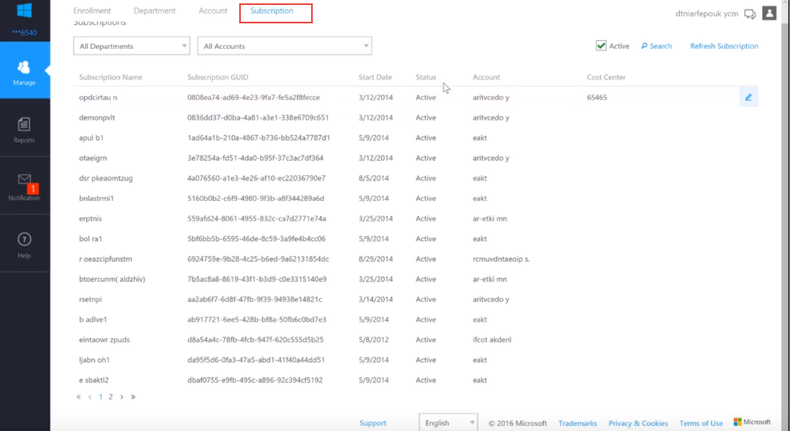

# Governance

In real life, scaffolding is used to create the basis of the structure. The scaffold guides the general outline and provides anchor points for more permanent systems to be mounted. An enterprise scaffold is the same: a set of flexible controls and Azure capabilities that provide structure to the environment, and anchors for services built on the public cloud. It provides the builders (IT and business groups) a foundation to create and attach new services.

The following image describes the components of the scaffold. The foundation relies on a solid plan for departments, accounts, and subscriptions. The pillars consist of Resource Manager policies and strong naming standards. The rest of the scaffold comes from core Azure capabilities and features that enable a secure and manageable environment. The enterprise scaffold is explicitly designed for the Resource Manager model.

## Hierarchy for Enterprise enrollments

The foundation of the scaffold is the Azure Enterprise Enrollment (and the Enterprise Portal). The enterprise enrollment defines the shape and use of Azure services within a company and is the core governance structure. Within the enterprise agreement, customers can further subdivide the environment into departments, accounts and finally, subscriptions. An Azure subscription is the basic unit where all resources are contained. It also defines several limits within Azure, such as number of cores, resources, etc.

Every enterprise is different and the hierarchy in the previous image allows for significant flexibility in how Azure is organized within the company. Before implementing the guidance contained in this document, the hierarchy should be modelled and the impact on billing, resource access, and complexity understood.

### Patterns ###

The three common patterns for Azure enrolments are:

  - Functional pattern

  - Business unit pattern

  - Geographic pattern

The following roles will be defined:

EA = Enterprise Admin, DA = Department Admin, AO = Account Owner, SA = Service Admin

First, the administrators are defined in the portal (ea.azure.com). This could be either a Microsoft or a work or school account. We recommend using a Work-Account.

Secondly, the departments are created. A department can’t live without DA. If there is no DA specified, the EA will be the DA of the department:

Once the department is created, accounts can be created on the department. Each department needs to have account owners, those are the only one who can create subscriptions on the account. If a EA wants to create subscriptions on an account, he needs to add himself as the account owner.

At the account level, each account can be named as Dev/Test and therefore be treated separately:

When the account is created, a subscription can be assigned:

This approach is resumed in the CSP Model – whereas the customer doesn’t have an Enterprise portal, but multiple subscriptions that are bound to his Active Directory.

Source: <https://docs.microsoft.com/en-us/azure/security/governance-in-azure>
Source: <https://www.credera.com/blog/credera-site/azure-governance-part-2-using-subscriptions-resource-groups-building-blocks/>

## CSP Hierarchy

If Azure Services are provided by a Cloud Service Provider, all the administrative elements above the subscription are eliminated. Within the CSP, the different defined subscriptions are bound directly to an Azure Active Directory (Azure AD).

CSP provided Azure subscriptions can only be managed over the ARM (Azure Resource Manager) Portal. There are no service or co-administrators. To control access, Azure provides roles (see chapter 16.3 Role based access control (RBAC)).

The CSP licence provider is always the owner over all of the ordered subscriptions and defines who else is owner of a subscription. This definition is modelled on the Azure AD tenant of the CSP.

The rights on the Subscription come over a Foreign Principal from the CSP Tenant. You can only choose between the following roles:
- Admin Agent
- Helpdesk Agent
- Sales Agent

The problem is, that this authorization will be applied overall tenants at the same time. And currently, it is not possible to use Privileged Identity Management for clients, from CSP Tenant.

Source: <https://docs.microsoft.com/en-us/azure/cloud-solution-provider/customer-management/administration-delegation>

## Lighthouse

Azure Lighthouse offers service providers a single control plane to view and manage Azure across all their customers with higher automation, scale, and enhanced governance. With Azure Lighthouse, service providers can deliver managed services using comprehensive and robust management tooling built into the Azure platform. This offering can also benefit enterprise IT organizations managing resources across multiple tenants.

This helps to fill the gap from the CSP right delegation. With Azure Lighthouse it's possible to delegate a lot of services, granularly per customer. The following are to the beginning supported services:
- Azure Automation
- Azure Backup
- Azure Monitor
- Azure Policy
- Azure Resource Graph
- Azure Security Center
- Azure Service Health
- Azure Site Recovery
- Azure Virtual Machines
- Azure Virtual Network

Under the following link you can find the actual list:
https://docs.microsoft.com/en-us/azure/lighthouse/concepts/cross-tenant-management-experience#supported-services-and-scenarios

Source: <https://docs.microsoft.com/en-us/azure/lighthouse/overview>
Source: <https://docs.microsoft.com/en-us/azure/lighthouse/concepts/cross-tenant-management-experience>
