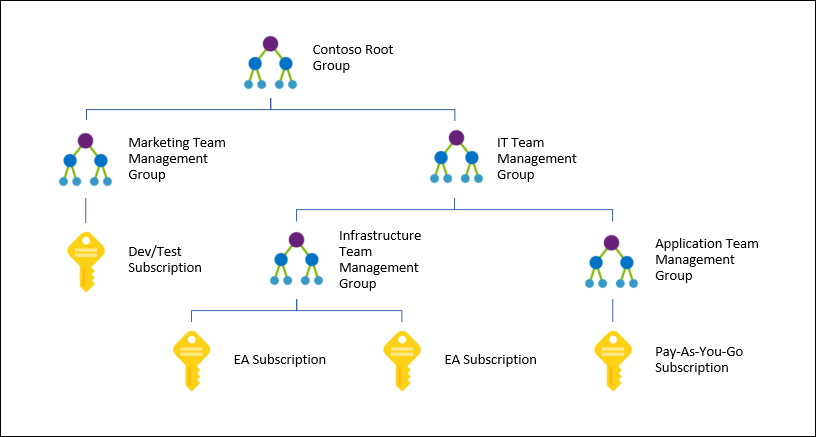

# Management Groups

## Overview 

If your organization has many subscriptions, you may need a way to efficiently manage access, policies, and compliance for those subscriptions. Azure management groups provide a level of scope above subscriptions. You organize subscriptions into containers called "management groups" and apply your governance conditions to the management groups. All subscriptions within a management group automatically inherit the conditions applied to the management group. Management groups give you enterprise-grade management at a large scale no matter what type of subscriptions you might have.

For example, you can apply policies to a management group that limits the regions available for virtual machine (VM) creation. This policy would be applied to all management groups, subscriptions, and resources under that management group by only allowing VMs to be created in that region.

## Hierarchy of management groups and subscriptions

You can build a flexible structure of management groups and subscriptions to organize your resources into a hierarchy for unified policy and access management. The diagram shows an example of creating a hierarchy for governance using management groups.

By creating a hierarchy like this example you can apply a policy, for example, VM locations limited to US West Region on the group "Infrastructure Team management group" to enable internal compliance and security policies. This policy will inherit onto both EA subscriptions under that management group and will apply to all VMs under those subscriptions. As this policy inherits from the management group to the subscriptions, this security policy cannot be altered by the resource or subscription owner allowing for improved governance.

Another scenario where you would use management groups is to provide user access to multiple subscriptions. By moving multiple subscriptions under that management group, you have the ability create one role-based access control (RBAC) assignment on the management group, which will inherit that access to all the subscriptions. Without the need to script RBAC assignments over multiple subscriptions, one assignment on the management group can enable users to have access to everything they need.

Important facts about management groups:

  - 10,000 management groups can be supported in a single directory.

  - A management group tree can support up to six levels of depth.

  - This limit doesn't include the Root level or the subscription level.

  - Each management group and subscription can only support one parent.

  - Each management group can have multiple children.

  - All subscriptions and management groups are contained within a single hierarchy in each directory. See Important facts about the Root management group for exceptions during the Preview.

## Management Group Access

Azure management groups support Azure Role-Based Access Control (RBAC) for all resource accesses and role definitions. These permissions are inherited to child resources that exist in the hierarchy. Any built-in RBAC role can be assigned to a management group that will inherit down the hierarchy to the resources. For example, the RBAC role VM contributor can be assigned to a management group. This role has no action on the management group but will inherit to all VMs under that management group.

The following chart shows the list of roles and the supported actions on management groups.

| RBAC Role Name              | Create | Rename | Move | Delete | Assign Access | Assign Policy | Read |
| --------------------------- | ------ | ------ | ---- | ------ | ------------- | ------------- | ---- |
| Owner                       | X      | X      | X    | X      | X             | X             | X    |
| Contributor                 | X      | X      | X    | X      |               |               | X    |
| MG Contributor\*            | X      | X      | X    | X      |               |               | X    |
| Reader                      |        |        |      |        |               |               | X    |
| MG Reader\*                 |        |        |      |        |               |               | X    |
| Resource Policy Contributor |        |        |      |        |               | X             |      |
| User Access Administrator   |        |        |      |        | X             |               |      |

\*: MG Contributor and MG Reader only allow users to perform those actions on the management group scope.

## Sources

[Management Groups on docs.microsoft.com](<https://docs.microsoft.com/en-us/azure/governance/management-groups/index>)