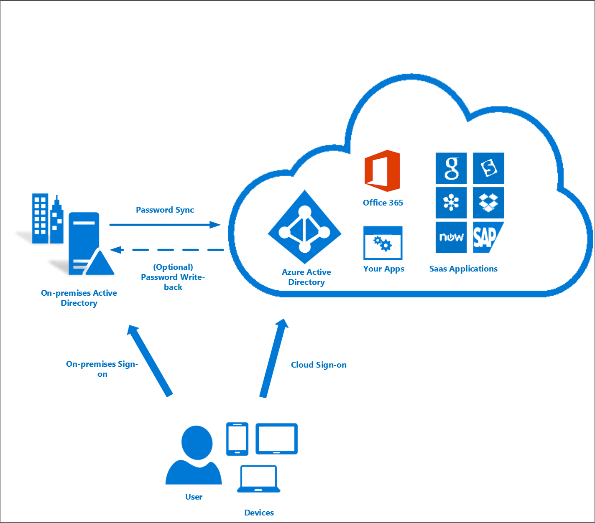
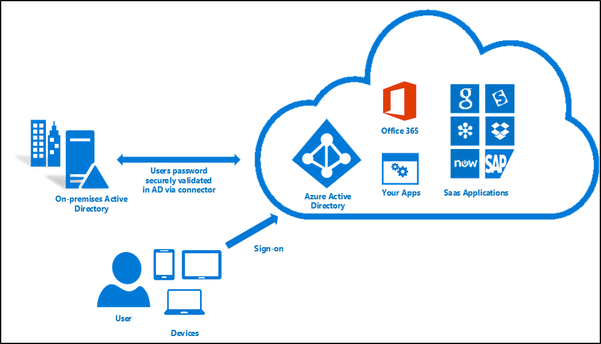

# Identity Management

## AD Connect

Azure AD Connect will integrate your on-premises directories with Azure Active Directory. This allows you to provide a common identity for your users for Office 365, Azure, and SaaS applications integrated with Azure AD. This topic will guide you through the planning, deployment, and operation steps. It is a collection of links to the topics related to this area.

We recommend using Azure AD Connect. If Azure Active Directory Sync is in use, we recommend as well to upgrade to AD Connect, as DirSync is deprecated.

  - Synchronizing users to Azure AD is a free feature and doesn’t require customers to have any paid subscription.

  - Synchronized users are not automatically granted any license. Admins still have total control on the license assignment.

  - Microsoft’s recommendation is for IT admins to synchronize all their users. This not only unblocks the users to access any Azure AD integrated resource but also gives a much broader view for IT admins to see what applications are being accessed by their users.

Azure Active Directory Connect is made up of three primary components: the synchronization services, the optional Active Directory Federation Services component, and the monitoring component named Azure AD Connect Health.

  - Synchronization - This component is responsible for creating users, groups, and other objects. It is also responsible for making sure identity information for your on-premises users and groups is matching the cloud.

  - AD FS - Federation is an optional part of Azure AD Connect and can be used to configure a hybrid environment using an on-premises AD FS infrastructure. This can be used by organizations to address complex deployments, such as domain join SSO, enforcement of AD sign-in policy, and smart card or 3rd party MFA.

  - Health Monitoring - Azure AD Connect Health can provide robust monitoring and provide a central location in the Azure portal to view this activity. For additional information, see Azure Active Directory Connect Health.

## User Sign-in options

Azure Active Directory (Azure AD) Connect allows your users to sign in to both cloud and on-premises resources by using the same passwords. This article describes key concepts for each identity model to help you choose the identity that you want to use for signing in to Azure AD.

  - Password hash synchronization with Seamless Single Sign-on (SSO)

  - Pass-through authentication with Seamless Single Sign-on (SSO)

  - Federated SSO (with Active Directory Federation Services (AD FS))

| I need to                                                                                              | PHS with SSO | PTA with SSO | AD FS |
| ------------------------------------------------------------------------------------------------------ | ------------ | ------------ | ----- |
| Sync new user, contact, and group accounts in on-premises Active Directory to the cloud automatically. | x            | x            | x     |
| Set up my tenant for Office 365 hybrid scenarios.                                                      | x            | x            | x     |
| Enable my users to sign in and access cloud services by using their on-premises password.              | x            | x            | x     |
| Implement single sign-on by using corporate credentials.                                               | x            | x            | x     |
| Ensure that no passwords are stored in the cloud.                                                      |              | x\*          | x     |
| Enable on-premises multi-factor authentication solutions.                                              |              |              | x     |

\*Through a lightweight agent.

### Password hash synchronization

With password hash synchronization, hashes of user passwords are synchronized from on-premises Active Directory to Azure AD. When passwords are changed or reset on-premises, the new password hashes are synchronized to Azure AD immediately so that your users can always use the same password for cloud resources and on-premises resources. The passwords are never sent to Azure AD or stored in Azure AD in clear text. You can use password hash synchronization together with password write-back to enable self-service password reset in Azure AD.

In addition, you can enable Seamless SSO for users on domain-joined machines that are on the corporate network. With single sign-on, enabled users only need to enter a username to help them securely access cloud resources.

### Pass-through authentication

With pass-through authentication, the user’s password is validated against the on-premises Active Directory controller. The password doesn't need to be present in Azure AD in any form. This allows for on-premises policies, such as sign-in hour restrictions, to be evaluated during authentication to cloud services.

Pass-through authentication uses a simple agent on a Windows Server 2012 R2 domain-joined machine in the on-premises environment. This agent listens for password validation requests. It doesn't require any inbound ports to be open to the Internet.

In addition, you can also enable single sign-on for users on domain-joined machines that are on the corporate network. With single sign-on, enabled users only need to enter a username to help them securely access cloud resources.

### Federation with a new or existing farm with AD FS

With federated sign-in, your users can sign in to Azure AD-based services with their on-premises passwords. While they're on the corporate network, they don't even have to enter their passwords. By using the federation option with AD FS, you can deploy a new or existing farm with AD FS in Windows Server 2012 R2. If you choose to specify an existing farm, Azure AD Connect configures the trust between your farm and Azure AD so that your users can sign in.

## Best practices

### Centralize identity management

One important step towards securing your identity is to ensure that IT can manage accounts from one single location regarding where this account was created. While the majority of the enterprises IT organizations will have their primary account directory on-premises, hybrid cloud deployments are on the rise and it is important that you understand how to integrate on-premises and cloud directories and provide a seamless experience to the end user.

To accomplish this hybrid identity scenario we recommend three options:

  - Synchronize your on-premises directory with your cloud directory using Azure AD Connect

  - Federate your on-premises identity with your cloud directory using Active Directory Federation Services (AD FS)

  - Implement Passthrough Authentication (PTA).

Organizations that fail to integrate their on-premises identity with their cloud identity will experience increased administrative overhead in managing accounts, which increases the likelihood of mistakes and security breaches.

### Enable Single Sign-On (SSO)

When you have multiple directories to manage, this becomes an administrative problem not only for IT, but also for end users that will have to remember multiple passwords. By using SSO you will provide your users the ability of use the same set of credentials to sign-in and access the resources that they need, regardless where this resource is located on-premises or in the cloud.

Use SSO to enable users to access their SaaS applications based on their organizational account in Azure AD. This is applicable not only for Microsoft SaaS apps, but also other apps, such as Google Apps and Salesforce. Your application can be configured to use Azure AD as a SAML-based identity provider. As a security control, Azure AD will not issue a token allowing them to sign into the application unless they have been granted access using Azure AD. You may grant access directly, or through a group that they are a member of.

The decision to use SSO will impact how you integrate your on-premises directory with your cloud directory. If you want SSO, you will need to use federation, because directory synchronization will only provide same sign-on experience.

### Deploy password management

In scenarios where you have multiple tenants, or you want to enable users to reset their own password, it is important that you use appropriate security policies to prevent abuse. In Azure you can leverage the self-service password reset capability and customize the security options to meet your business requirements.

It is particularly important to obtain feedback from these users and learn from their experiences as they try to perform these steps. Based on these experiences, elaborate a plan to mitigate potential issues that may occur during the deployment for a larger group. It is also recommended that you use the Password Reset Registration Activity report to monitor the users that are registering.

Organizations that want to avoid password change support calls but do enable users to reset their own passwords are more susceptible to a higher call volume to the service desk due to password issues. In organizations that have multiple tenants, it is imperative that you implement this type of capability and enable users to perform password reset within security boundaries that were established in the security policy.

### Enforce multifactor authentication (MFA)

For organizations that need to be compliant with industry standards, such as PCI DSS version 3.2, multi-factor authentication is a must have capability for authenticate users. Beyond being compliant with industry standards, enforcing MFA to authenticate users can also help organizations to mitigate credential theft type of attack, such as Pass-the-Hash (PtH).

By enabling Azure MFA for your users, you are adding a second layer of security to user sign-ins and transactions. In this case, a transaction might be accessing a document located in a file server or in your SharePoint Online. Azure MFA also helps IT to reduce the likelihood that a compromised credential will have access to organization’s data.

### User role based access control (RBAC)

See [Role based access control (RBAC)]("../850 Role Based Access Control.md")

### Control locations where resources are created using resource manager

Enabling cloud operators to perform tasks while preventing them from breaking conventions that are needed to manage your organization's resources is very important. Organizations that want to control the locations where resources are created should hard code these locations.

To achieve this, organizations can create security policies that have definitions that describe the actions or resources that are specifically denied. You assign those policy definitions at the desired scope, such as the subscription, resource group, or an individual resource.

See section 16.5 Azure Policy.

### Actively monitor for suspicious activities

According to Verizon 2016 Data Breach report, credential compromise is still in the rise and becoming one of the most profitable businesses for cyber criminals. For this reason, it is important to have an active identity monitor system in place that can quickly detect suspicious behavior activity and trigger an alert for further investigation. Azure AD has two major capabilities that can help organizations monitor their identities: Azure AD Premium anomaly reports and Azure AD identity protection capability.

Make sure to use the anomaly reports to identify attempts to sign in without being traced, brute force attacks against a particular account, attempts to sign in from multiple locations, sign in from infected devices and suspicious IP addresses. Keep in mind that these are reports. In other words, you must have processes and procedures in place for IT admins to run these reports on the daily basis or on demand (usually in an incident response scenario).

In contrast, Azure AD identity protection is an active monitoring system and it will flag the current risks on its own dashboard. Besides that, you will also receive daily summary notifications via email. We recommend that you adjust the risk level according to your business requirements. The risk level for a risk event is an indication (High, Medium, or Low) of the severity of the risk event. The risk level helps Identity Protection users prioritize the actions they must take to reduce the risk to their organization.

Organizations that do not actively monitor their identity systems are at risk of having user credentials compromised. Without knowledge that suspicious activities are taking place using these credentials, organizations won’t be able to mitigate this type of threat.

Sources: <https://docs.microsoft.com/en-us/azure/active-directory/connect/active-directory-aadconnect>